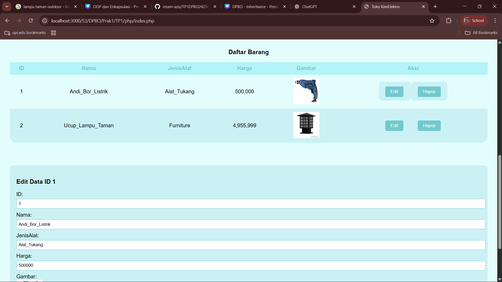

# 💻 TP1 DPBO - Imam Azizun Hakim - 2404420

## 🤝 Janji
"Saya Imam Azizun Hakim dengan NIM 2404420 mengerjakan Tugas Praktikum 1 dalam mata kuliah Desain Pemrograman Berorientasi Objek untuk keberkahan-Nya maka saya tidak akan melakukan kecurangan seperti yang telah di spesifikasikan."

## 🔀 Penjelasan Desain dan Kode Flow
- Menggunakan 1 class bernama **_KimElektro_** berisi 4 atribut _(5 kalau di php)_

### Class KimElektro
- Atribut **_KimElektro_** :
<pre>
  ● id         <strong>ID Barang yang Unik berupa String</strong>
  ● nama       <strong>Nama Barang berupa String</strong>
  ● JenisAlat  <strong>Jenis/Kategori Barang berupa String</strong>
  ● harga      <strong>Harga Barang berupa Integer</strong>
  ● gambar     <strong>Gambar Barang (untuk PHP)</strong>
</pre>

- Method **_KimElektro_** :
<pre>
  ● Constructor   <strong>Untuk membuat objek KimElektro yang baru</strong>
  ● Getter        <strong>Mengambil nilai atribut</strong>
  ● Setter        <strong>Mengubah nilai atribut</strong>
  ● Print Object  <strong>Harga Barang berupa Integer</strong>
</pre>

- Kode dibuat dalam 4 Bahasa, yaitu :
  - C++ 💠
  - Java ☕
  - Python 🐍
  - Php 🐘

- Flow Program memiliki 6 option di menu
<pre>
  1. Tambah Data        <strong>Create</strong>
  2. Lihat/Tampil Data  <strong>Read</strong>
  3. Edit Data          <strong>Update</strong>
  4. Hapus Data         <strong>Delete</strong>
  5. Cari Data          <strong>Searching</strong>
  6. Exit               <strong>Exit Program</strong>
</pre>

- Terdapat Error Handling Ketika
  - Memilih bukan option 1-6
  - Menambah data dengan **ID** yang sudah terpakai
  - Mengedit data dengan **ID** yang sudah terpakai
  - Menghapus data dengan **ID** yang tidak ada
  - Mencari data dengan **ID** yang tidak ada
    
 ## 📝 Dokumentasi
 **Berikut adalah Dokumentasi berupa Screenshot saat program dijalankan di Terminal dan Web(Php)**
 ### C++
  
  
  
  
  
  
  
  
  
  
  
  
  
  
---
 ### Java
  
  
  
  
  
  
---
 ### Python
  
  
  
  
  
 
---
 ### Php
   
  
  
  
  
  
  
  
  
  
  
  
  
  
  
  
  
